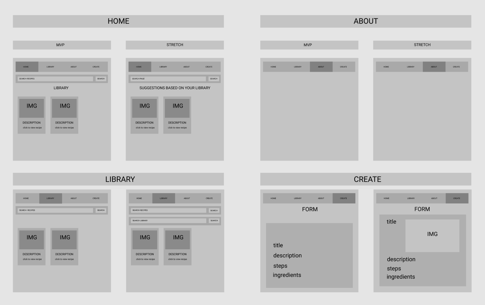
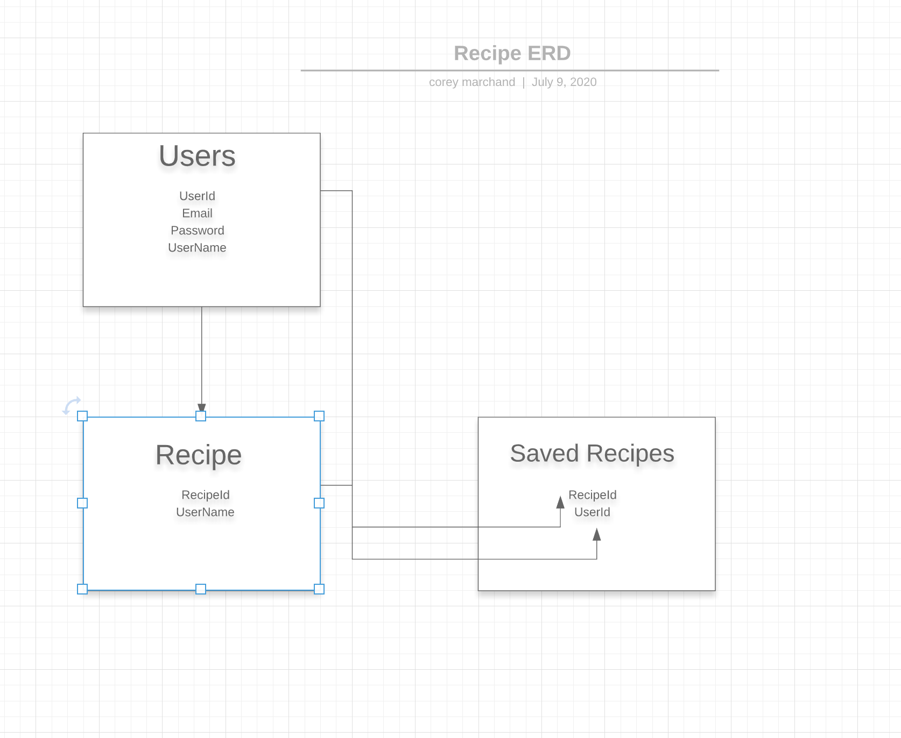

# [Team Smart not Hard](https://github.com/smart-not-hard) : PGC
## Members:
- [Peng Chen](https://github.com/PengChen11)
- [Corey Marchand](https://github.com/corey-marchand)
- [H Griffin](https://github.com/h-griffin)

# Live Site [Foodiejounals.com](https://foodiejournals.com)
<!-- ## [Heroku Deployed Backend](https://foodie-journal.herokuapp.com/) -->
<!-- ## [Vercel Deployed Site]() -->
## Live Vercel Site [Foodiejounals.vercel.app](https://foodiejournals.vercel.app/)
## [GitHub Repo](https://github.com/smart-not-hard/foodie-journal)
## [GitHub Project Board](https://github.com/smart-not-hard/foodie-journal/projects/1)
## [Front End Github](https://github.com/smart-not-hard/foodie-journals-front-end)

# Project description: 
## Foodie Journal :
a place to find and save recipes, to custom user accounts, saving to a database
## final

## whiteboard 

## Entity Relationship Diagram

## User Stories
view github project board for user stories

## Tools
#### Front End: 
React.js
Next.js
bootstrap
sass
vercel

#### Back End:
Python
Django
Docker
PostgreSQL
SQLite
ElephantSQL
heroku/aws

## [click to see step by step set up/creation](progress.md)

## Links and Resources 
- [vercel CDN](https://vercel.com/edge-network)

